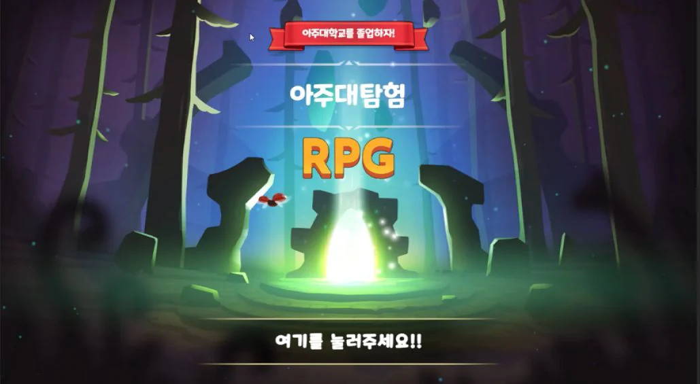
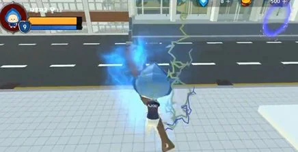
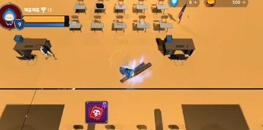
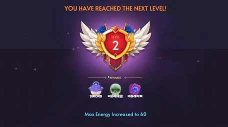
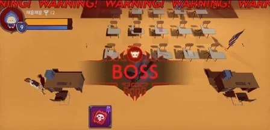

# 아주대탐험

아주대학교 캠퍼스를 돌아다니며 몬스터를 잡고 졸업을 향해 성장하는 Unity 3D 게임. 탐색과 전투에 서로 다른 시점을 주고, 그 전환을 연출이 아니라 **모드를 통째로 바꾸는 시스템**으로 만들었다.



| | |
|---|---|
| 기간 | 2024.08 ~ 2024.12 (커밋 82개, 2024-09-23 ~ 11-18) |
| 인원 | 1명 — 시스템 설계 · C# 구현 · 씬 배치 · UI 전부. 커밋 82개가 모두 `toadsam` 이고 `Player_JJH` · `Player2_JJH` 브랜치도 같은 사람이다 |
| 엔진 | Unity 2022.3.23f1 · C# · AI Navigation 1.1.5 · Input System 1.7.0 |
| 영상 | https://www.youtube.com/watch?v=mtIiIWmrSdg |
| 배포 | 없음. 빌드를 배포하지 않았고 Unity 에디터에서 실행한다 |

## 5분만 있다면

1. [`PlayerModeManager.SetPlayerMode()`](Assets/Script/Manager/PlayerModeManager.cs#L42-L73) — 이 게임의 축. 시점을 바꿀 때 카메라만 옮기지 않고 컨트롤러 두 개, 카메라의 부모, Rigidbody 제약을 한 번에 바꾼다. 아래 「결정과 근거」 첫 항목이 여기다.
2. [`MonsterAI.Update()`](Assets/Script/Monster/MonsterAI.cs#L40-L63) — 상태 하나가 메서드 하나인 전투 AI. 거리 조건만으로 Idle → Move → Chase → Attack 을 오간다. 아래 「알고 있는 빚」에 적은 Die 상태 문제도 같은 파일에 있다.
3. [`SpecialQuest.StartRandomMission()`](Assets/Script/Special/SpecialQuest.cs#L117-L161) — 돌발 미션 3종을 코루틴 하나로 돌린다. 성공 조건을 `System.Func<bool>` 로 받아 타이머와 판정을 갈라 둔 자리.

## 무엇이 돌아가나

| | |
|---|---|
|  |  |
| `PlayerMode.FirstPerson`. 캠퍼스를 걸어 다니고, 포탈에 닿으면 대화창이 떠서 다음 건물로 갈지 묻는다. | `PlayerMode.TopDown`. `T` 를 누르면 카메라가 플레이어에게서 떨어져 나가고 추적 카메라가 붙는다. 같은 캐릭터, 같은 조작키, 다른 게임처럼 보인다. |
|  |  |
| 몬스터를 잡으면 경험치가 들어오고([`MonsterStats.Die()`](Assets/Script/Monster/MonsterStats.cs#L40-L49)), 레벨이 오르면 전체 스킬 목록에서 **랜덤 3개**가 버튼에 얹힌다. 이미 가진 스킬을 다시 고르면 강화된다. | 웨이브는 1~5. 다섯 번째가 보스고, 소환 전에 경고 패널을 3초 띄운다([`WaveManager.StartWave()`](Assets/Script/Manager/WaveManager.cs#L57-L93)). |

이 밖에 돌발 미션 3종(오브젝트 찾기 · 몬스터에게 도달 · 몬스터 전멸)과 성공 시 능력치 강화, 포탈 대화 UI, `Q` 로 20초간 부르는 로봇 소환, 아이템으로 몸 크기와 이동 속도를 잠시 바꾸는 효과가 있다.

## 직접 쓴 것과 사서 쓴 것

Unity 프로젝트는 저장소 부피의 대부분이 남의 것이다. 그래서 경계를 먼저 적는다.

| | |
|---|---|
| 직접 쓴 C# | `Assets/Script` 아래 **40개 파일 3,245줄** — Manager 8 · Player 13 · Monster 5 · Skills 5 · Robot 3 · Map 2 · 그 외 4 |
| 직접 구성한 것 | 씬 5개, 프리팹 37개, 그 밖 애니메이션 · 이미지 · 스킬 구성까지 77개 파일 |
| 외부 에셋 팩 | **16종 8,959개 파일** — Layer Lab 4,882 · POLYGON city pack 1,064 · SineVFX 950 · TirgamesAssets 623 · Violet Theme Ui 547 · Hovl Studio 211 · Plasma FX 209 · Suriyun 115 등 |

캠퍼스 건물, 몬스터 모델, 파티클, UI 스킨은 전부 사서 썼다. 그것들이 무엇을 하는지는 전부 `Assets/Script` 안에 있다.

## 결정과 근거

**시점을 바꿀 때 카메라만 옮기지 않았다.** 처음에는 카메라 위치를 탑다운 좌표로 옮기는 것으로 끝내려 했다. 두 가지가 걸렸다. 1인칭 컨트롤러와 탑다운 컨트롤러가 같은 입력을 동시에 받아 서로 밀어냈고, 카메라를 좌표로만 옮기니 전환하는 프레임에 화면이 튀었다. 그래서 모드 하나가 세 가지를 함께 바꾸게 했다 — 컨트롤러 `enabled` 전환, 카메라의 부모(탐색 모드는 플레이어의 자식으로 붙이고 `localPosition`·`localRotation` 을 0 으로 리셋, 탑다운은 부모에서 떼어 `TopDownCameraFollow` 에 넘김), Rigidbody 제약([`L42-L73`](Assets/Script/Manager/PlayerModeManager.cs#L42-L73)). 대가는 남았다. 탑다운으로 갈 때 Y 축을 즉시 잠그면 캐릭터가 착지하기 전에 공중에 고정된다. 그래서 **3초 기다렸다가 잠근다**([`L100-L105`](Assets/Script/Manager/PlayerModeManager.cs#L100-L105)). 그 3초는 계산한 값이 아니라 눈으로 맞춘 값이고, 지금도 스크립트에 박혀 있다.

**성장은 고정 스킬 트리 대신 레벨업마다 랜덤 3택.** 웨이브가 다섯 개뿐이라 정해진 트리를 타면 두 번째 판이 첫 판과 똑같아진다. 레벨이 오르면 전체 목록에서 세 개를 뽑아 버튼 셋에 얹고, 이미 가진 스킬이면 `Upgrade()`, 아니면 획득 후 1단계 발동으로 갈랐다([`L41-L51`](Assets/Script/Manager/InGameSkillManager.cs#L41-L51)). 다음 레벨에 필요한 경험치는 매번 2배가 된다([`PlayerStats.LevelUp()`](Assets/Script/Player/RealPlayer/PlayerStats.cs#L93-L106)). 대가가 둘 있다. 세 칸을 각각 독립으로 뽑아서 **같은 스킬이 두 칸에 나올 수 있고**, 중복 제거를 넣지 않았다. 그리고 고르는 동안 게임이 멈추지 않는다 — 커서 잠금만 풀어 마우스를 돌려줄 뿐이고, `Time.timeScale = 0` 은 포탈 대화에만 걸려 있다([`DialogueManager.Update()`](Assets/Script/Manager/DialogueManager.cs#L47-L63)).

**웨이브 전환은 콜백 대신 매 프레임 세기로.** 몬스터가 죽는 경로가 둘이었다. `MonsterAI` 는 사망 애니메이션을 보여주려고 2초 뒤에 파괴하고([`L165-L170`](Assets/Script/Monster/MonsterAI.cs#L165-L170)), `MonsterStats` 는 체력이 0 이 되는 즉시 파괴한다([`L40-L49`](Assets/Script/Monster/MonsterStats.cs#L40-L49)). 어느 쪽도 웨이브에 죽음을 알리지 않는다. 죽는 쪽마다 콜백을 다는 대신 `WaveManager` 가 스폰한 오브젝트를 큐에 넣고 매 프레임 살아 있는 수를 세게 했다([`L113-L129`](Assets/Script/Manager/WaveManager.cs#L113-L129)). 누가 어떻게 죽든 상관없어진 대신, 웨이브가 안 넘어갈 때 볼 수 있는 건 로그뿐이다. 큐에서 빼지도 않아 지나간 웨이브의 죽은 참조가 계속 쌓인다.

## 알고 있는 빚

- **플레이어가 죽지 않는다.** 체력이 0 이 되면 `PlayerStats.Die()` 가 로그 한 줄을 찍고 끝난다([`L108-L111`](Assets/Script/Player/RealPlayer/PlayerStats.cs#L108-L111)). 게임 오버 화면도 재시작도 없다.
- **문은 다섯인데 열리는 건 하나다.** `SceneLoader` 는 성호관 · 원천관 · 팔달관 · 산학관 · 학생회관 다섯 포탈을 알지만([`L28-L48`](Assets/Script/Map/SceneLoader.cs#L28-L48)) `Assets/Scenes` 에 실제로 있는 것은 원천관과 학생회관 둘이고, 대사가 등록된 포탈은 성호관과 원천관 둘이다([`DialogueManager.InitializePortalDialogues()`](Assets/Script/Manager/DialogueManager.cs#L65-L77)). 겹치는 것은 원천관 하나뿐이다.
- **쓰지 않는 전환 경로가 남아 있다.** `PlayerModeManager` 의 트리거 분기는 `PortalToTopDown` · `PortalToFirstPerson` 태그를 보는데([`L88-L98`](Assets/Script/Manager/PlayerModeManager.cs#L88-L98)) 두 태그 모두 `ProjectSettings/TagManager.asset` 에 없다. 시점 전환은 `T` 키로만 확인했다.
- **죽는 몬스터가 매 프레임 다시 죽는다.** `Die` 상태에 들어가도 `Update` 의 switch 가 계속 돌아서, 파괴되기까지 2초 동안 사망 트리거와 `Destroy` 예약이 반복된다([`MonsterAI.cs#L59-L61`](Assets/Script/Monster/MonsterAI.cs#L59-L61)).
- **웨이브마다 몬스터가 한 마리다.** `StartWave` 의 다섯 case 가 전부 `monstersRemaining = 1` 이라 전투 분량이 얇다. 균형값(3초 · 20초 · 30초 · 경험치 2배)도 전부 스크립트에 박혀 있어 바꾸려면 코드를 고쳐야 한다.
- **자동 테스트가 없다.** 확인은 전부 에디터에서 Play 를 눌러 했다.
- **소스 인코딩이 섞여 있다.** 대부분의 `.cs` 주석이 CP949 라 GitHub 웹에서 깨져 보인다(`PlayerController.cs` 만 UTF-8). `PlayerController2.cs` 는 본문이 전부 주석 처리된 빈 파일이고 아직 지우지 않았다.

## 실행하기

<details>
<summary>Unity Hub 에서 열고 시작 씬을 Play 한다 — 외부 서비스도 환경변수도 없다</summary>

1. Unity Hub 에서 **2022.3.23f1** 을 설치한다(`ProjectSettings/ProjectVersion.txt` 값).
2. 저장소 루트 폴더를 Unity 프로젝트로 연다. 에셋 팩이 많아 첫 임포트가 오래 걸린다.
3. `Assets/Scenes/StartSenece.unity` 를 열고 Play. 시작 버튼이 `DemoScene` 을 부른다(씬에 저장된 `sceneToLoad` 값). 본편은 `DemoScene` 이고, 원천관 포탈로 들어가면 `WoncheonHallScene` 으로 넘어간다.

조작 — 앞의 다섯은 `Assets/PlayerInputActions/PlayerInputActions.inputactions`, 뒤의 셋은 `Input.GetKeyDown` 에서 확인한 것이다.

| 키 | 동작 |
|---|---|
| `W` `A` `S` `D` | 이동 |
| 마우스 | 시점 |
| `Shift` | 달리기 |
| `Space` | 점프 |
| 마우스 좌클릭 | 공격 |
| `T` | 탐색 ↔ 탑다운 시점 전환 |
| `Q` | 로봇 소환 (20초 유지 · 20초 쿨타임) |
| `R` `E` | 스킬 토글 |

빌드 씬 목록과 태그는 `ProjectSettings/EditorBuildSettings.asset` · `TagManager.asset` 에 있다.

</details>

<details>
<summary>폴더</summary>

```text
Assets/Script/              직접 쓴 C# 40개 — Manager · Player · Monster · Skills · Special · Robot · Map · Camera
Assets/Scenes/              DemoScene(본편) · StartSenece(타이틀) · WoncheonHallScene · Student Union · MainScence
Assets/Prefebs/             몬스터 · 아이템 · UI 프리팹
Assets/PlayerInputActions/  Input System 액션 맵
Assets/(그 외)              외부 에셋 팩 16종 — 건물 · 캐릭터 · VFX · UI 스킨
ProjectSettings/            Unity 2022.3.23f1 · 빌드 씬 목록 · 태그
```

</details>

## 만든 사람

정재훈 — 아주대학교. 기획부터 코드, 씬 배치, UI 까지 혼자 만들었다. 다른 작업은 [포트폴리오 마을](https://jaehun.co.kr)과 [GitHub](https://github.com/toadsam) 에 있다.

코드와 화면은 포트폴리오 공개 목적이며, 별도 표기 전까지 무단 사용·복제·배포를 허용하지 않는다. 외부 에셋 팩의 저작권은 각 제작자에게 있다.
